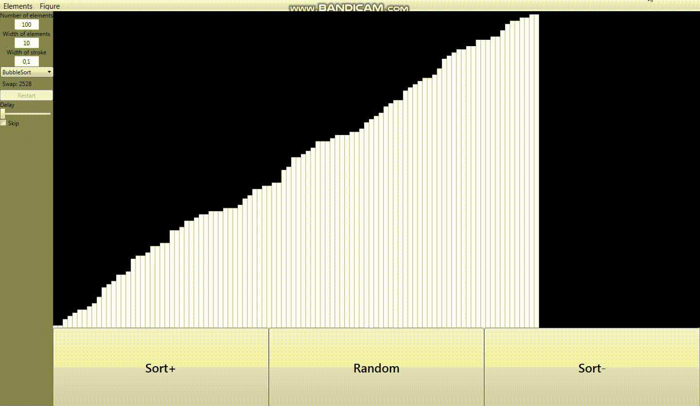

# VisualSorting
# Visualization of differents data-sorting algorithms 
<!DOCTYPE html> 
<html> 
<head> 
</head>
<body> 
	

		
<h2>Fist start</h2>

		

	

	

		
<h2>Chosing colors</h2>

		

	

	

		
<h2>Finished sorting</h2>

		

	

	

		
<h2>BubbleSort</h2>

		

	

	

		
<h2>CocktailSort</h2>

		

	

	

		
<h2>ShellSort</h2>

		

	

	

		
<h2>QuickSort</h2>

		

	

</body> 

</html>